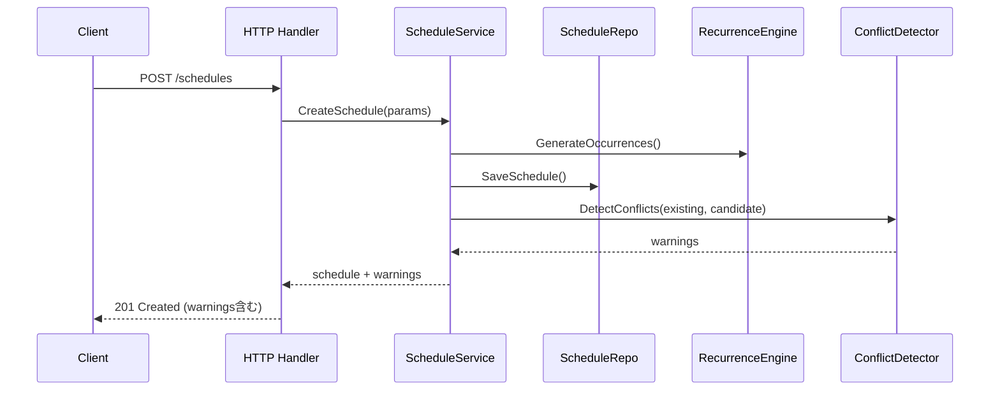

# スケジュール作成・更新ワークフロー

## 作成フロー

### 成功時挙動
- 新規 ID を発行し、スケジュール本体と参加者を挿入。
- 繰り返し指定がある場合 `recurrences` テーブルを更新。
- 警告があれば `warnings` に `type` と詳細を格納（作成は継続）。

### 警告時
- `participant_overlap`: 参加者の既存予定と重複。
- `room_overlap`: 会議室が別の予定と重複。
- API レスポンスは 201 のまま、`error_code=CONFLICT_DETECTED` を併記可能。

## 更新フロー
1. クライアントが `PUT /schedules/{id}` を送信。
2. ハンドラーが認証・権限チェック（作成者または管理者）。
3. `ScheduleService` が差分を適用し、再度 `ConflictDetector` を実行。
4. `RecurrenceEngine` は繰り返し設定の変更を検証（曜日の縮小/拡大）。
5. 競合警告が存在しても更新は完了。

### エラー時挙動
- `ErrCreatorImmutable`: 作成者変更試行時に 403 + `AUTH_FORBIDDEN`。
- `ErrScheduleNotFound`: 404 + `SCHEDULE_NOT_FOUND`。
- `ErrInvalidTimeRange`: 422 + `VALIDATION_FAILED`。

## 繰り返しエンジン
- 週次のみ対応。開始日を基準に `weekdays` を反映したオカレンスを生成。
- タイムゾーンは JST 固定。`until` が未設定なら 90 日先まで生成（UI で拡張）。
- 生成結果は永続化せず、API レスポンスでプレビューを返す（MVP）。

### 性能検証と警告キャッシュ
- `internal/recurrence/engine_benchmark_test.go` のベンチマークで週次ルールを 3 か月先まで生成し、`go test -bench=BenchmarkEngineGenerateOccurrences ./internal/recurrence` で遅延を継続監視する。
- `ScheduleService` は一覧 API の警告生成結果を 30 秒間（最大 128 エントリ）メモリキャッシュし、CRUD 操作完了時に無効化することで繰り返し検出負荷を抑える。
- キャッシュキーはリクエストパラメータとフィルター境界（参加者、期間、プリンシパル情報）で構成し、認可境界を越えた再利用を防ぐ。

## 削除フロー
- `DELETE /schedules/{id}` は論理削除せず完全削除。
- 参照整合性: `schedule_participants` と `recurrences` は ON DELETE CASCADE。
- クライアントには 204 を返す。

