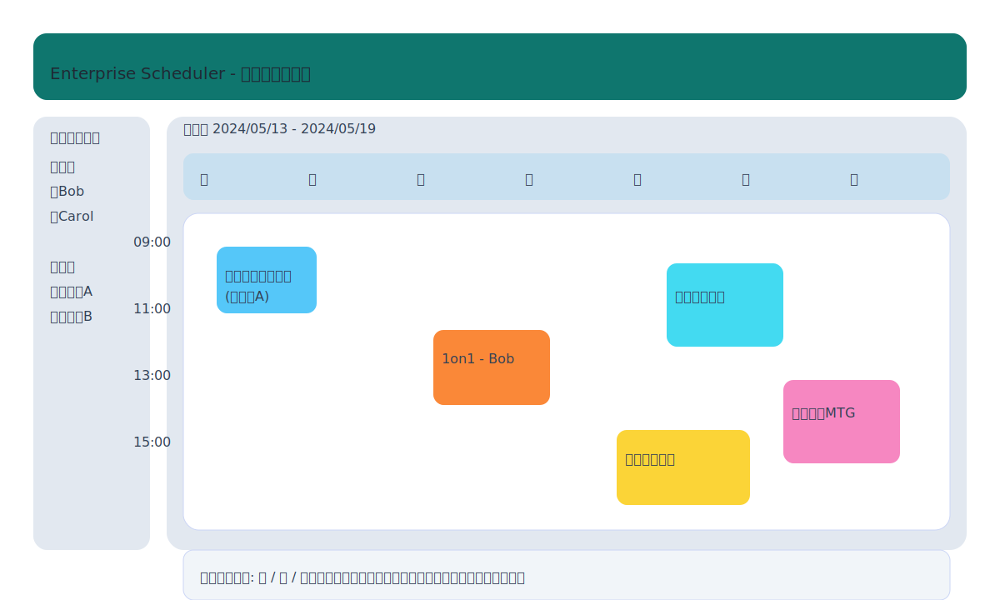

# 利用者向けクイックスタート

## 想定ユーザーフロー
1. ログイン画面でメールアドレスとパスワードを入力し、`ログイン` をクリック。
2. 週表示カレンダーが開き、自分の予定が表示される。
3. 同僚を追加表示するには、画面右上の `同僚を選択` ボタンからユーザーを選択。
4. 新規予定を作成するには、希望の時間枠をクリックしフォームに入力。
5. 競合警告が表示された場合でも保存は完了し、警告内容が画面上部に表示される。

## 週次プランナー UI モック

モックでは以下の主要遷移を確認できる。

- **ビュー切り替えドロップダウン**：週 / 日 / 月ビューをワンクリックで切り替える。切り替え時は同じ参加者選択が維持され、画面遷移なしで即座にビューが変化する。
- **参加者トグル**：左カラムで自分・同僚を複数選択すると、週表示上に予定が色分けで重なり表示される。チェック解除で即座に非表示となる。
- **会議室セレクター**：同じカラム内に会議室一覧があり、予約フォームの候補と同期する。選択済み会議室は予定カードにも `(会議室A)` のように注記される。
- **競合警告バナー**：競合検出時には予定一覧の下部にバナーが差し込まれ、エラーではなく警告として保存後も参照可能。

## ビュー別の操作感
- **週表示**: 月曜日開始。左側に時間軸（08:00〜18:00）。スクロールで 24 時間表示。トラックパッド／ホイールで滑らかに拡張。
- **日表示**: 参加者切り替え後もレイアウトは縦スクロール。選択されたユーザーごとにカラムが分割され、詳細な時間調整向き。
- **月表示**: 予定の件数とタイトルが簡略表示。クリックで詳細ポップアップ。モックでは週→月遷移時に右カラムの参加者選択状態を維持する。

## 操作例（図解付き解説）
1. **会議室予約**
   - フォームの会議室プルダウンから `会議室A` を選択。
   - `競合警告: 会議室A は 10:30〜11:00 に既存予定があります` と表示された場合は時間を調整するか警告を承知で保存。
2. **繰り返し予定**
   - `繰り返し` オプションで `週次` を選択し、`月曜日` と `木曜日` を指定。
   - プレビューがフォーム下部に表示され、各発生日時と警告一覧を確認可能。
3. **同僚の予定確認**
   - 右カラムのユーザーリストから `Bob` と `Carol` を選択。
   - 週表示に各ユーザーの予定が色分けで表示。

## ヒント
- 予定カードをドラッグして時間変更（MVP 後の拡張機能）。
- キーボードショートカット: `N` で新規予定、`←/→` で週移動（対応予定）。
- エラーが出た場合は画面下部の `サポートへ連絡` から問い合わせ。
- 競合警告を閉じた後も、画面右上の `警告ログ` アイコンから最新 10 件を再確認できる仕様を想定。

